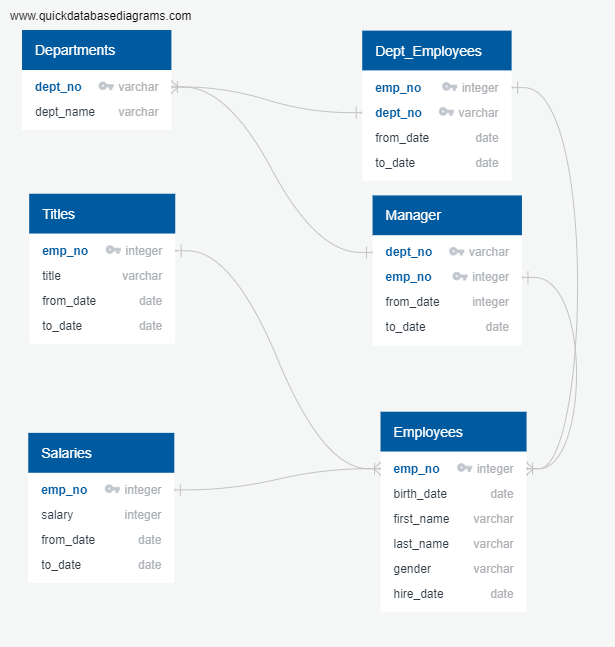
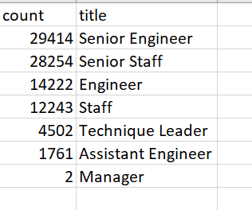
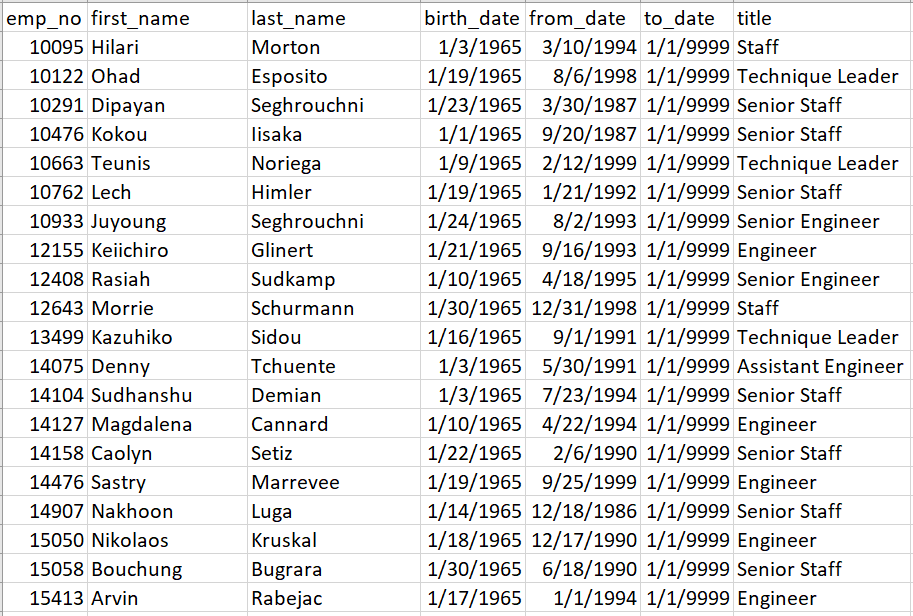

# Employee Database Analysis

## **Overview of the Employee Database Analysis**: the purpose of this analysis was to determine the number of retiring employees per title, and to identify employees who are eligible to participate in a mentorship program.

### To that end, we were first asked to create a Retirement Titles table that holds all the titles of current employees who were born between January 1, 1952 and December 31, 1955. We first retrieved emp_no, first_name, and last_name columns from the Employees table. We then retrieved the title, from_date, and to_date columns from the Titles table. We created a new table, called retirement_titles. Because there were duplicates due to the fact that some employees had been promoted throughout their careers, we had to use a DISTINCT ON function in order to retrieve their latest job titles. The data was saved in a different table, labeled unique_titles.

### Secondly, we were asked to create a mentorship-eligibility table that holds the current employees who were born between January 1, 1965 and December 31, 1965. We retrieved emp_no, first_name, last_name, and birth_date columns from the Employees table. We also retrieveed the from_date and to_date columns from the Department Employee table. And finally we retrieve the title column from the Titles table. Again, we had to use a DISTINCT ON function to eliminate duplicates. We joined the Employees and the Department Employee tables on the primary key, as well as joined the Employees and the Titles tables on the primary key. Finally, the data was filtered to only display current employees (to_date = 9999-01-01) whose birth dates were between January 1, 1965 and December 31, 1965. Our data was saved in a table called mentorship_eligibilty.

## **Results**: 

### Below are four major points from the two analysis deliverables:

1. In the retirement_titles table, we have 133,776 employees who are retiring. However, we have duplicates since many employees were promoted during their employment. This table does show how long they have held each position during their careers.
2. In the unique_titles table, we have removed duplicates and only kept the retiring employees' most recent titles. We now have a list of 90,398 employees who are retiring. 
3. The retiring_titles table summarizes the number of retiring employees by job title. There are 7 titles total, with the majority of the employees falling in the Senior Engineer title (33% of the total retiring employees).

4. The mentorship_eligibilty table shows that there are 1,549 employees who are eligible to be mentored as they are current employees born between January 1, 1965 and December 31, 1965.

## **Analysis summary**:

### There are **90,398 employees** who are about to retire (born between January 1, 1952 and December 31, 1955), over 60% of them currently holding Senior positions (Senior Engineers and Senior Staff). Unfortunately, we only counted **1,549 employees* who are eligible to be mentored, creating a gap of 88,849 employees.

### What our mentorship_eligibilty table doesnt summarize is the number of eligible employees by job title. Since we will need to replace many Senior Engineers and Senior Staff, we need to understand which position these eligible employees currently hold. We could query our mentorship_eligibilty table to display the SELECT COUNT by mentorship_eligibilty.title.

### Lastly, our mentorship_eligibilty table is also missing the department names where most retiring employees currently work as well as the department names were eligible mentors are working. There may be gap of potential talents is specific departments, and it would be interesting to know that to understand where Pewlett Packard needs to invest heavily. In order to get this data, we would need to JOIN information from our Dept_emp table, which includes a dept_no column using the emp_no as our primary key.  